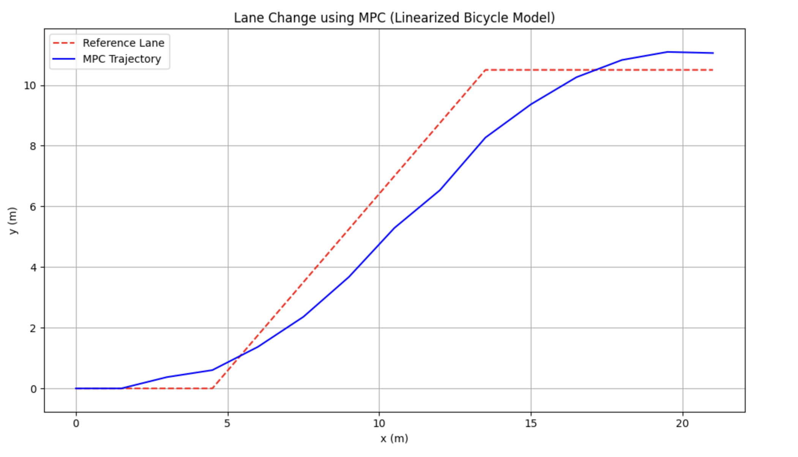

# Lane-Changing-Using-Controller-Design-with-Torque-Vectoring,-Rear-Wheel-Steering,-and-Truck-Trailer-Dynamics

Lane-changing control using **Model Predictive Control (MPC)** with torque vectoring, rear-wheel steering, and full truck-trailer hitch dynamics. The project simulates both a **linearized 4-wheel bicycle model** and a **nonlinear articulated truck-trailer system**, enhanced by an **Extended Kalman Filter (EKF)** for state estimation. It compares advanced actuation strategies and vehicle configurations for improved lateral tracking, yaw control, and high-speed maneuverability.

# MPC Lane Change with EKF - Linearized 4-Wheel Vehicle Model

This repository demonstrates a simple lane change and hold maneuver using **Model Predictive Control (MPC)** with a linearized 4-wheel (bicycle) vehicle model, enhanced by an **Extended Kalman Filter (EKF)** for state estimation.

---

##  Vehicle Model and Dynamics

We use a **linearized bicycle model** (4-wheel simplification) assuming constant longitudinal velocity \(v_x = v_{\text{long}}\). The actual vehicle has 4 wheels, but for simplicity, we merge:
- The left and right **front tires** into a single equivalent front wheel.
- The left and right **rear tires** into a single equivalent rear wheel.

This results in a 2-wheel bicycle model.

###  Assumptions in Bicycle Model

1. **Symmetric vehicle:**
   - Identical left/right tires
   - No roll or pitch modeled

2. **Single steering input:**
   - The front wheels' steering is simplified into one average value \(\delta\).

3. **Tire force approximation:**
   - Lateral tire forces:
     \[
     F_y = -C_\alpha \cdot \alpha
     \]
     where \(C_\alpha\) is the cornering stiffness, and \(\alpha\) is the slip angle.

4. **Slip angles:**
   - Front:
     \[
     \alpha_f = \delta - \frac{v_y + a r}{v_x}
     \]
   - Rear:
     \[
     \alpha_r = - \frac{v_y - b r}{v_x}
     \]

6. **The tire is not saturated** (i.e., \( F_y \ll \mu F_z \)), meaning the linear tire model is valid and the lateral force does not exceed the friction limit.

5. **Simplified dynamics:**

   - Valid for low to moderate speeds where tire behavior is approximately linear

   - No use of advanced tire models like Pacejka’s Magic Formula

   - No load transfers or weight shifts are considered (constant normal forces)

---

### Continuous-Time Dynamics (Before Linearization)

State vector:
\[
\begin{bmatrix}
 v_y \\
 r
\end{bmatrix}, \quad \text{where } v_y = \text{lateral velocity}, \; r = \text{yaw rate}
\]

Equations of motion:
\[
\begin{aligned}
\dot{v}_y &= \frac{1}{m} (F_{yf} + F_{yr}) - v_x r \\
\dot{r} &= \frac{1}{I_z} (a F_{yf} - b F_{yr})
\end{aligned}
\]

Substituting tire forces:
\[
\begin{aligned}
F_{yf} &= -C_f \left( \delta - \frac{v_y + a r}{v_x} \right) \\
F_{yr} &= -C_r \left( -\frac{v_y - b r}{v_x} \right)
\end{aligned}
\]

Plugging into the equations:
\[
\dot{v}_y = \frac{1}{m} \left( -C_f \left( \delta - \frac{v_y + a r}{v_x} \right) - C_r \left( \frac{v_y - b r}{v_x} \right) \right) - v_x r
\]
\[
\dot{r} = \frac{1}{I_z} \left( -a C_f \left( \delta - \frac{v_y + a r}{v_x} \right) + b C_r \left( \frac{v_y - b r}{v_x} \right) \right)
\]

These are **nonlinear** due to \(v_x\) in the denominators and the product terms with \(\delta\). To make this model usable in optimization, we **linearize** around a nominal point and discretize.

---

##  Linearized Discrete-Time Dynamics (Used in MPC)

After linearizing around \(v_y = 0, r = 0, \delta = 0\), and assuming constant speed \(v_x\), we obtain:

\[
\begin{aligned}
A &= \begin{bmatrix}
A_{11} & A_{12} \\
A_{21} & A_{22}
\end{bmatrix}, \quad
B = \begin{bmatrix}
B_1 \\
B_2
\end{bmatrix} \\
\text{with:} \\
A_{11} &= -\frac{2C_f + 2C_r}{m v_x}, \quad A_{12} = -v_x - \frac{2C_f a - 2C_r b}{m v_x} \\
A_{21} &= -\frac{2C_f a - 2C_r b}{I_z v_x}, \quad A_{22} = -\frac{2C_f a^2 + 2C_r b^2}{I_z v_x} \\
B_1 &= \frac{2 C_f}{m}, \quad B_2 = \frac{2 C_f a}{I_z}
\end{aligned}
\]

The full linearized discrete-time update (Euler) becomes:
\[
\begin{aligned}
v_y[k+1] &= v_y[k] + \Delta t (A_{11} v_y[k] + A_{12} r[k] + B_1 \delta[k]) \\
r[k+1] &= r[k] + \Delta t (A_{21} v_y[k] + A_{22} r[k] + B_2 \delta[k]) \\
y[k+1] &= y[k] + \Delta t (v_y[k] + v_x \cdot \psi[k]) \\
\psi[k+1] &= \psi[k] + \Delta t \cdot r[k]
\end{aligned}
\]

*Figure: x vs y trajectory of the vehicle’s lane change — reference vs MPC output*

*Figure: Steering input over trajectory*

*Figure: Tracking error vs time*

As visible from the figures, the controller reaches the maximum allowable steering angle during cornering. However, this alone is not sufficient to minimize the tracking error. To enhance the vehicle's controllability and improve tracking performance, we introduce an additional actuation technology: Torque Vectoring (TV).

###  Torque Vectoring (TV)

**Concept:**
Torque vectoring modulates the torque difference between left and right wheels (especially rear wheels) to generate a **yaw moment** without steering input. It effectively assists in cornering and stabilization, especially at high speeds.

**Modeling:**
We augment the yaw dynamics with a control input \( u_{tv} \) that directly contributes to the yaw moment:
\[
\dot{r} = \frac{1}{I_z} (a F_{yf} - b F_{yr}) + \frac{1}{I_z} u_{tv}
\]

In the linearized discrete model:
\[
r[k+1] = r[k] + \Delta t (A_{21} v_y[k] + A_{22} r[k] + B_2 \delta[k] + B_{tv} u_{tv}[k])
\]

where:
- \( B_{tv} = \frac{1}{I_z} \)
- \( u_{tv} \) is an additional optimization variable representing the yaw moment from torque vectoring

A regularization term \( \lambda_{tv} \cdot u_{tv}^2 \) is added to the cost function to penalize unnecessary torque usage.

*Figure: x vs y trajectory of the vehicle’s lane change — reference vs MPC output with Torque Vectoring added*

*Figure: Steering input over trajectory with Torque Vectoring added *

Lane_Change_Using_MPC_RearWheelSteering.png

*Figure: Torrque Vectoring input over trajectory with  *

Torque Vectoring slightly reduced the total steering input usage; however, it did not significantly improve tracking error. This is likely because the yaw moment generated through torque distribution between the rear wheels was too small to meaningfully influence the vehicle's lateral dynamics. At higher speeds or during sharp maneuvers, the required lateral forces for accurate path tracking are much larger, and torque vectoring alone—especially in a simplified linear model without load transfer or nonlinear tire effects—cannot generate enough corrective force to reduce tracking error.

###  Rear-Wheel Steering (RWS)

**Concept:**
Rear wheels are allowed to steer with angle \( \delta_r \), improving agility at low speeds and stability at high speeds. The rear slip angle becomes:
\[
\alpha_r = \delta_r - \frac{v_y - b r}{v_x}
\]

**Modeling:**
We now have two steering inputs:
- \( \delta_f \): front steering angle
- \( \delta_r \): rear steering angle

Both contribute to lateral forces:
\[
\begin{aligned}
F_{yf} &= -C_f \left( \delta_f - \frac{v_y + a r}{v_x} \right) \\
F_{yr} &= -C_r \left( \delta_r - \frac{v_y - b r}{v_x} \right)
\end{aligned}
\]

Linearized yaw dynamics now becomes:
\[
\dot{r} = \frac{1}{I_z} (a F_{yf} - b F_{yr})
\]
\[
\Rightarrow r[k+1] = r[k] + \Delta t (A_{21} v_y[k] + A_{22} r[k] + B_{2f} \delta_f[k] + B_{2r} \delta_r[k])
\]

with:
- \( B_{2f} = \frac{2 C_f a}{I_z} \)
- \( B_{2r} = -\frac{2 C_r b}{I_z} \)

The cost function is extended with a penalty on \( \delta_r \) to avoid excessive rear steering:
\[
J = \sum_k \left( \text{tracking error} + w_{\delta_f} \cdot \delta_f^2 + w_{\delta_r} \cdot \delta_r^2 \right)
\]

*Figure: x vs y trajectory of the vehicle’s lane change — reference vs MPC output with Rear Wheel Steering added*

*Figure: Steering input over trajectory with  Rear Wheel Steering added *

As shown in the figures, rear-wheel steering significantly improves cornering behavior and control authority. The tracking error decreased by more than 20 times, demonstrating a substantial enhancement in path-following performance. 

### Trailer

In addition to conventional passenger vehicle models, this project also includes a realistic **truck-trailer system** modeled as an articulated vehicle with dynamic hitch feedback. This extension is crucial for simulating long and heavy vehicles that require careful coordination between the truck and trailer during maneuvers.

The trailer is not controlled directly; instead, it follows the truck based on the kinematic and dynamic behavior at the hitch. Importantly, the trailer applies a **reaction torque** back to the truck, which is captured in the full dynamic model.

#### 🔧 Key Features:
- Full coupling between truck and trailer yaw dynamics
- Hitch force feedback influencing truck yaw acceleration
- Trailer yaw rate dynamics driven by hitch forces
- Penalization of misalignment between truck and trailer headings to discourage jackknife behavior
- Truck is responsible for tracking the reference path, while trailer alignment is enforced through cost terms

#### 🔍 Modeled States:
- \(v_y\): Lateral velocity of the truck  
- \(r\): Yaw rate of the truck  
- \(\psi\): Yaw angle (heading) of the truck  
- \(y\): Lateral position of the truck  
- \(\psi_R\): Yaw angle of the trailer  
- \(r_R\): Yaw rate of the trailer  

The MPC cost function tracks the truck’s lateral deviation while minimizing steering effort and trailer misalignment. This enables the truck to perform safe and smooth lane changes without inducing trailer swing or jackknife instability.

**Tire Forces:**

\[
\begin{aligned}
F_{yf} &= -C_f \left( \delta - \frac{v_y + a r}{v_x} \right) \\
F_{yr} &= -C_r \left( \frac{-v_y + b r - l_t (r_R - r)}{v_x} \right) \\
F_{yR} &= -C_r \left( \frac{l_t (r_R - r)}{v_x} \right)
\end{aligned}
\]

**Truck Dynamics:**

\[
\begin{aligned}
\dot{v}_y &= \frac{F_{yf} + F_{yr}}{m_T} - v_x r \\
\dot{r} &= \frac{a F_{yf} - b F_{yr} + l_t F_{yR}}{I_{zT}} \\
\dot{y} &= v_x \cdot \sin(\psi) \\
\dot{\psi} &= r
\end{aligned}
\]

**Trailer Dynamics:**

\[
\begin{aligned}
\dot{\psi}_R &= r_R \\
\dot{r}_R &= -\frac{l_t F_{yR}}{I_{zR}}
\end{aligned}
\]

---

### 🔍 Notebooks

- [Lane Change using MPC (Jupyter Notebook)](LaneChange.ipynb)
- - [Lane Change using MPC with Torque Vectoring (Jupyter Notebook)](LaneChange_with__TorqueVectoring.ipynb)
  - - [Lane Change using MPC with Rear Wheel Steering (Jupyter Notebook)](LaneChange_with_RearWheelSteering.ipynb)

##  Project Overview

- Predictive controller (MPC) tracks a fixed lateral reference trajectory
- Extended Kalman Filter (EKF) estimates unmeasured states from noisy observations

